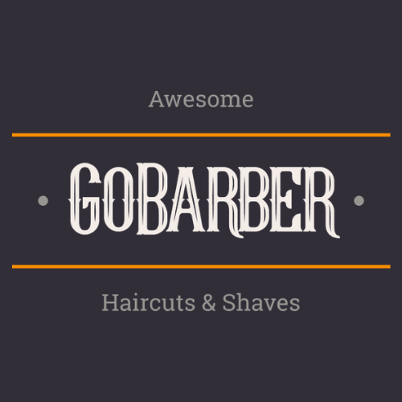
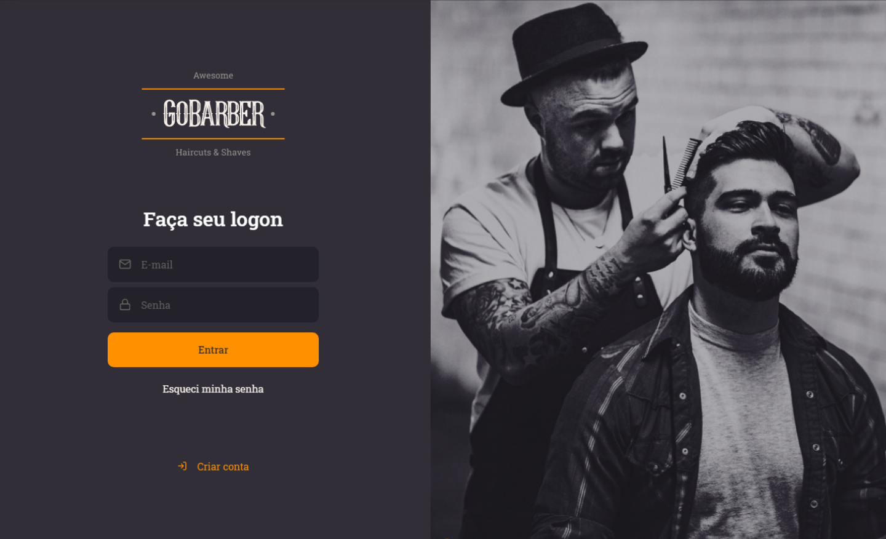
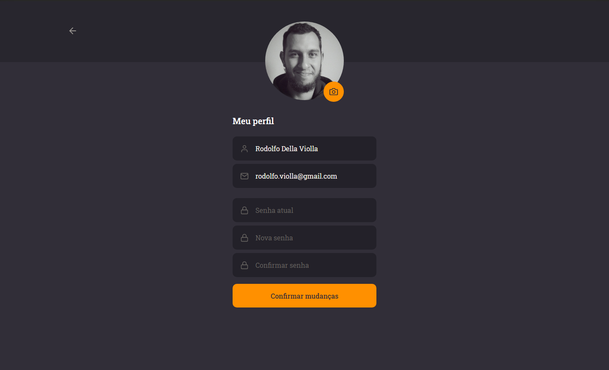
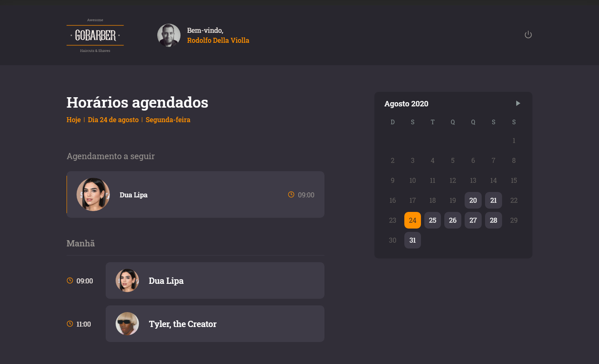
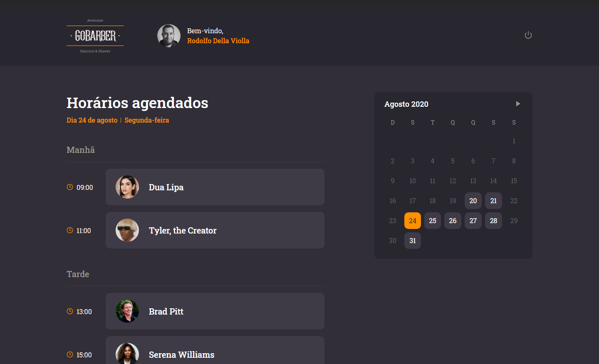

<h1 align="center">
  
</h1>
<h3 align="center">
  Controle a agenda de sua barbearia com estilo 🧔
</h3>
<p align="center">(Aplicação desenvolvida durante o Bootcamp GoStack da Rocketseat)</p>
<p align="center">
  <br />
  
  <a href="#">
    
  </a>
  
  <a href="#">
    
  </a>
  
  <a href="https://github.com/rodolfoviolla/gostack-gobarber-frontend-web/blob/master/LICENSE">
    
  </a>
</p>

<p align="center">
  <a href="#features">Features</a> •
  <a href="#pr%C3%A9-requisitos">Pré-requisitos</a> • 
  <a href="#rodar-a-aplica%C3%A7%C3%A3o-localmente">Rodar a aplicação localmente</a> • 
  <a href="#tecnologias">Tecnologias</a> • 
  <a href="#autor">Autor</a> • 
  <a href="#licen%C3%A7a">Licença</a>
</p>

<p align="center">
  
  
  
  
</p>

### Features

- [X] Cadastro de usuário
 - Cadastro de novo usuário
 - Recuperação senha de usuário já cadastrado
 - Alteração de avatar e dados do perfil
- [x] Login / Logout
 - Acesso à funcionalidades de criação e consulta apenas por usuário logado
- [X] Consulta de agendamentos apenas do usuário logado

### Pré-requisitos

Você vai precisar ter instalado em sua máquina as seguintes ferramentas:
[Git](https://git-scm.com), e [Yarn](https://classic.yarnpkg.com/pt-BR/)
Além disto é bom ter um editor para trabalhar com o código como [VSCode](https://code.visualstudio.com/)

### Rodar a aplicação localmente

Para rodar a aplicação, você precisa rodar o [back-end em Node.js](https://github.com/rodolfoviolla/gostack-gobarber-backend) localmente na porta 3333

Após rodar o back-end, siga os seguintes passos:

```bash
# Clone do repositório do front-end web (fora da pasta do back-end)
$ git clone <https://github.com/rodolfoviolla/gostack-gobarber-frontend-web>

# Acesse a pasta do projeto no teminal/cmd
$ cd gostack-gobarber-frontend-web

# Instale as dependências
$ yarn

# Execute a aplicação em modo de desenvolvimento
$ yarn start

# A aplicação inciará na porta:3000 - acesse <http://localhost:3000>
```

### Tecnologias

As seguintes ferramentas foram usadas na construção do projeto:

- [ReactJS](https://pt-br.reactjs.org/)
- [TypeScript](https://www.typescriptlang.org/)

### Autor
---

<p>
  <a href="#">
    
    <br />
    <sub><b>Rodolfo Della Violla</b></sub>
  </a>

  <p>
    <a href="https://www.linkedin.com/in/rodolfoviolla/">
      
    </a>
    <a href="https://twitter.com/RodolfoViolla">
      
    </a>
    <a href="mailto:rodolfo.violla@gmail.com">
      
    </a>
  </p>
</p>

## Licença

Este projeto esta sobe a licença [MIT](./LICENSE.md).
